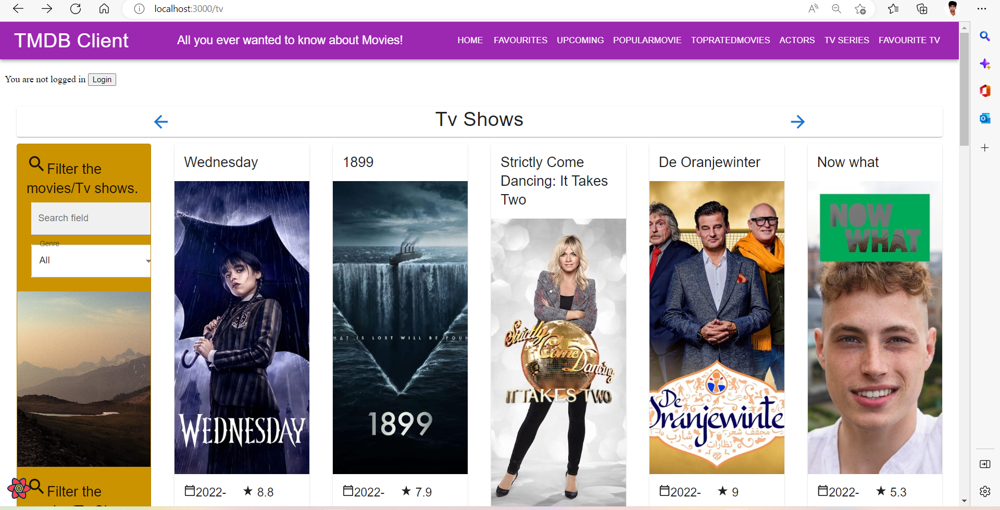
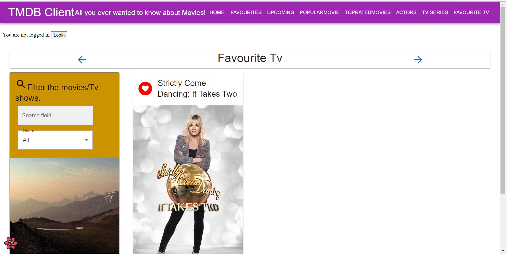
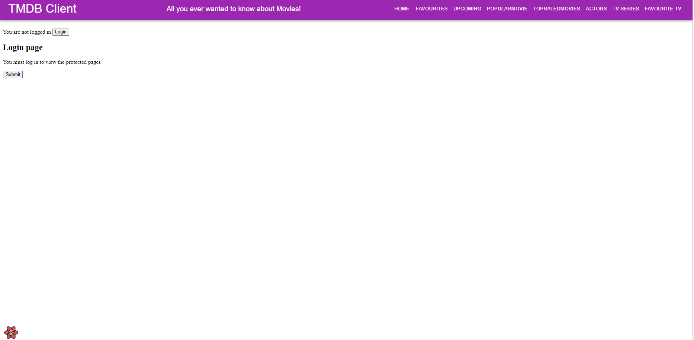
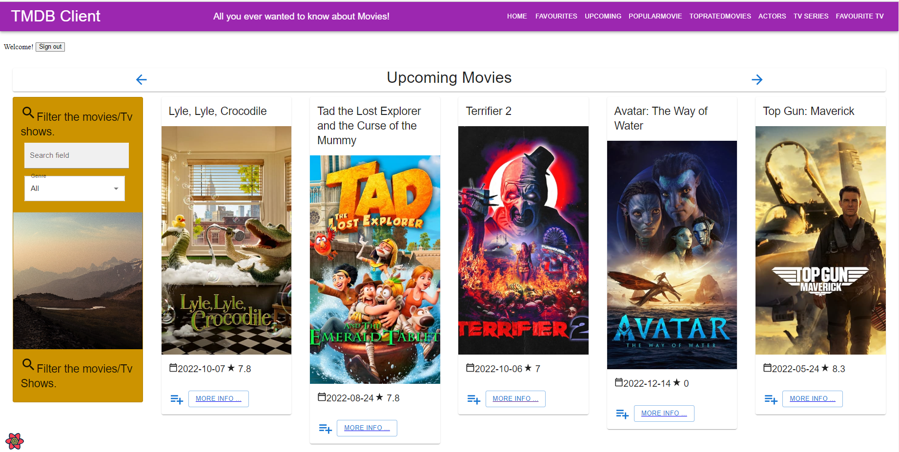
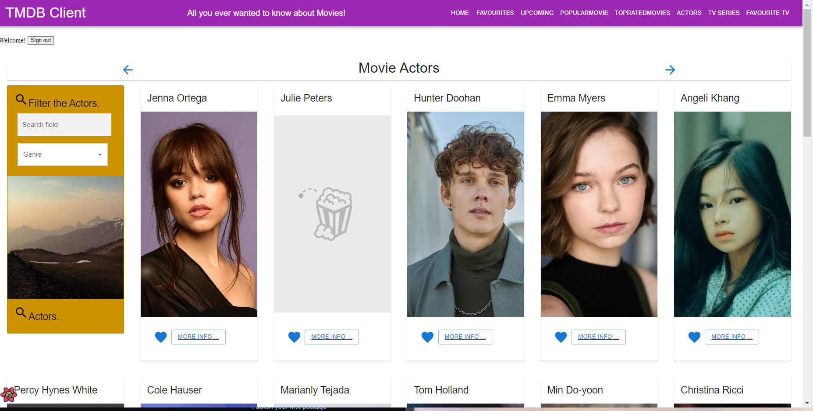
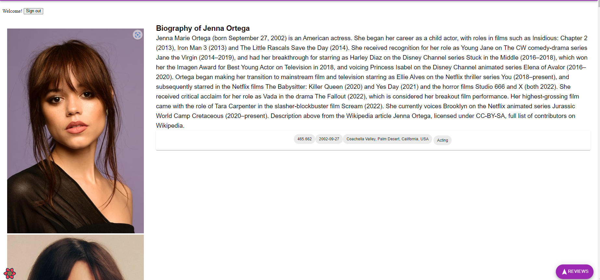
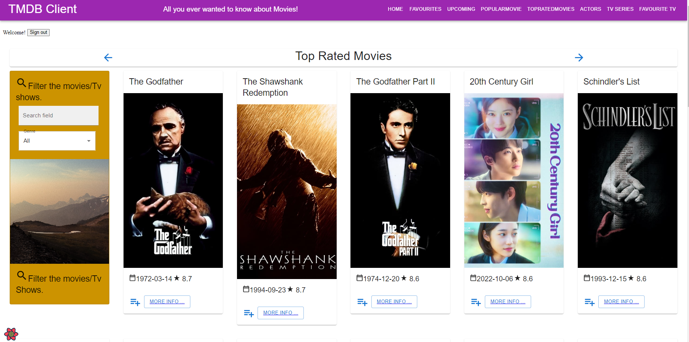
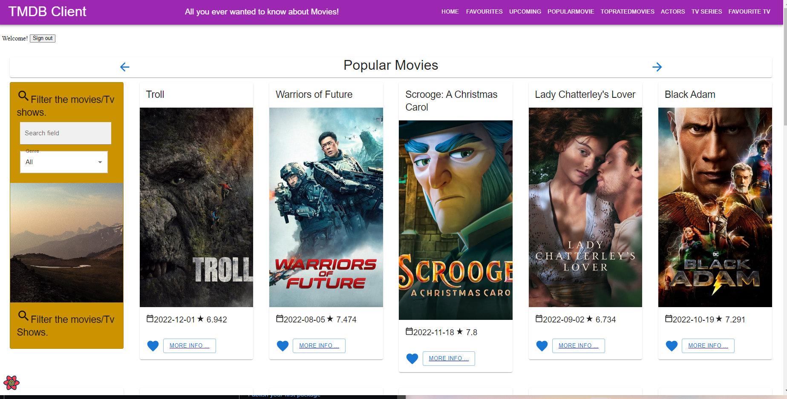
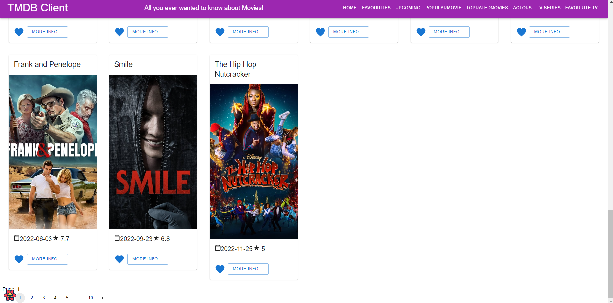

# Web App Dev 2 - Assignment 1 - ReactJS app.

Name: Kedaranath

## Overview.

### New Pages.

[ Provide a bullet-point list of the new pages you added to the Movies Fan add (include modifications to existing pages).]

e.g.

+ List of Trending movies.
+ (Modified) Movie Details page - added chips for genres.
+ TopRated Movie Page. 
+ Tv series Page.
+ Favourite Tv Series Page.
+ List of Actors added chip for actors know departmnet.
+ Popular Movies Page.

### New Features.

[ Provide a bullet-point list of the __new features__ you added to the Movies Fan app.] 
 
 e.g.

+ Authentication
+ Pagination
+ Add Cast in the movie details page
+ Favourite Tv series
## Setup requirements.

[ Outline any non-standard setup steps necessary to run your app locally after cloning the repo.]

## TMDB endpoints.

[ List the __additional__ TMDB endpoints used, giving the description and pathname for each one.] 

e.g.

+ /movies/{movie_id}/reviews - The user reviews or a movie.
+ /movie/{movie_id}/similar - A list of similar movies. 
+ /person/popular - A list of  actors.
+ person/${id}-actor Details
+ /tv/{tv_id}/videos - The TV show. 
+ /movie/top_rated-Top rated movie.
+ person/${id}-popular movie

## App Design.

### Component catalogue.

[ Insert a screenshot from the Storybook UI, and highlight the stories that relate to your __new/modified components__ - see the example screenshot below.] .......

e.g.

### UI Design.
[ show the tv shows ].

[ While press favourtie icon in the tv series page it will add in the tv favourite page ).

[ Added authentication for the upcomping movie to view the view that page have to log in first ].

[Able  to view the actors page]

[ show the actor details like about them and birth date etc. ].

[ Created two more pages there popular and toprated movies]

[ have a pagination which means able to view different movie while pressing the pagination button and added them in the home page]

>Shows detailed information on a movie. Clicking the 'Reviews' floating action button will display extracts from critic reviews.

>Shows the full review for a movie.

### Routing.

[ List the __new routes__ supported by your app and state the associated page.]

e.g. 

+ /actors - displays a list of popular actors.
+ /actors/:id - shows details about a particular actor.
+ /movie/upcoming(protected)-have to login to the page to see 
+ /tv-display the tv shows are going
+ /tv/:id -give the details of the tv shows 
+ /movie/toprated-Toprated movies page can be able to view
+ /movie/popular-can view the popular movies
+ /tv/favourites-able to see the favourite tv shows

[If relevant, state what aspects of your app are protected/private (i.e. require authentication) and what is public.]

## Independent learning (If relevant).

[ Itemize the technologies/techniques you researched independently and adopted in your project, i.e. aspects not covered in the lectures/labs. Mention the source code filenames that illustrate these  (code excerpts are not required) and provide references to the online resources that helped you (articles/blogs).
